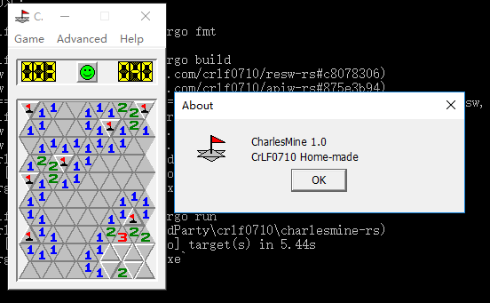

# CharlesMine-rs
A triangle minesweeper game in Rust.

By porting the earlier C version [i wrote years ago](https://github.com/crlf0710/charlesmine), 
**I'm doing some early research into both how to write applications with Rust, and how to design a GUI toolkit in pure Rust**. 
Currently the backend is Microsoft-technology oriented, so the program is Windows-only. Backends for other OSes might be coming next.

# Screenshot


# Installation
Make sure you're using Rust windows msvc toolchain and target. Run


```cargo install --git https://github.com/crlf0710/charlesmine-rs```


<small>Theorically you can also build this with exactly the same command with windows gnu toolchain and target, 
however you'll need to get yourself `windres.exe` and put its directory in `PATH`. 
You can check your configuration with `windres --version` before you 
run `cargo install` to see whether the tool is available. </small>

# Libraries
The implementation is quite modular. Several libraries that developed along with it can be used independently. Check them out:
* [APIW-rs](https://github.com/crlf0710/apiw-rs): Safe interfaces for Windows API. Window creation, message handling, GDI drawing, etc.
* [RESW-rs](https://github.com/crlf0710/resw-rs): Create executable resources (icons, menus, dialogs) from Rust code in `build.rs`.
* [concerto-rs](https://github.com/crlf0710/concerto-rs): Small state machine that manages complex ui action details.
* [domino-rs](https://github.com/crlf0710/domino-rs): Rust application separation of concern (SoC) experiment. Organize code as MVC components and communiate using messages.

